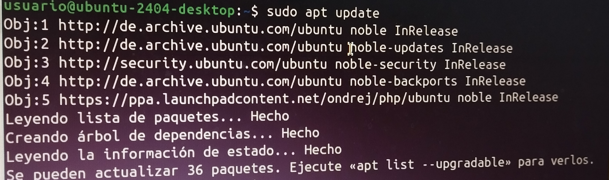

# Instalación de ownCloud
En este tutorial, enseñaré, paso a paso, cómo instalar ownCloud a través del terminal de Linux
## Instalación de apache2, MySQL y algunas librerías al contenedor
1. Actualización de la máquina.

Para actualizar la máquina, tendremos que poner el código **sudo apt update**. Después de eso, le daremos a enter.

Cuando nos pregunte la contraseña, pondremos usuario, todo en minúsculas, y le daremos a enter.

Después de esto, le pondremos otro comando, el cual es: **sudo apt upgrade**, y le daremos a enter.

Cuando nos pregunte si deseamos continuar, le daremos a enter para aceptar.

2. Instalación del servidor web 'Apache2'.

Para esto, en el terminal, tendremos que poner: **sudo apt install -y apache2**

3. Instalamos el servidor de bases de datos 'mysql-server'.

Tendremos que poner: **sudo apt install -y mysql-server**

4. Instalamos algunas librerías de PHP.

Esto lo haremos con el siguiente comando: **sudo apt install -y php libapache2-mod-php**

Seguido de esto, pondremos el comando:**sudo apt install -y php-fpm php-common php-mbstring php-xmlrpc php-soap php-gd php-xml php-intl php-mysql php-cli php-ldap php-zip php-curl**

5. Reiniciamos el servidor apache2.

Finalmente reiniciamos el servidor con el siguiente comando: **sudo systemctl restart apache2**

## Configuración de MySQL
### Accedemos a la consola de MySQL
En el terminal pondremos el siguiente comando **sudo mysql**.

### Creamos una base de datos
Lo haremos con el comando: **CREATE DATABASE bbdd;**

### Creamos un usuario
Esto lo haremos con el siguiente comando: **CREATE USER 'usuario'@'localhost' IDENTIFIED WITH mysql_native_password BY 'password';**

### Damos privilegios al usuario
Esto lo haremos con el siguiente comando: GRANT ALL ON bbdd.* to 'usuario'@'localhost';

### Salimos de la base de datos
Después de poner todos estos comandos de forma consecutiva, saldremos de MySQL con el comando: **exit**

### Instalar la versión 7.4 de PHP en Ubuntu 24.04
1. Instalamos los requisitos previos de PPA.

El primer paso será instalar los requisitos previos de PPA, que se instala con el siguiente comando: **sudo apt install software-properties-common -y**

2. Instalamos las herramientas necesarias para trabajar con los archivos de paquetes personales (PPA).

Después del paso anterior, ponemos el siguiente comando:**LC_ALL=C.UTF-8 sudo add-apt-repository ppa:ondrej/php -y**

3. Actualizaremos los repositorios.

Lo haremos con el siguiente comando: **sudo apt update**

4. Instalamos las librerías de PHP de la versión 7.4

Esto lo haremos en tres pasos; el primer paso será poner el siguiente comando: **sudo apt install php7.4 -y**

El segundo paso será poner el siguiente comando: **sudo apt install -y php libapache2-mod-php7.4**

Y por último, ponemos este comando: **sudo apt install -y php7.4-fpm php7.4-common php7.4-mbstring php7.4-xmlrpc php7.4-soap php7.4-gd php7.4-xml php7.4-intl php7.4-mysql php7.4-cli php7.4-ldap php7.4-zip php7.4-curl**

5. Seleccionamos la versión de PHP que queramos.

Como siguiente paso, seleccionaremos una versión de PHP, en este caso la 7.4.

Lo primero será escribir este comando en el terminal: **sudo update-alternatives --config php**

Después de esto, como tenemos que usar la versión 7.4, escribiremos la letra 2, en referencia al número que nos sale antes para meter la versión 7.4 y después de eso, le damos a enter.

6. Activamos los módulos de Apache2 necesarios.

Tendremos que poner dos códigos en nuestro terminal, el primero será: **sudo a2enmod proxy_fcgi setenvif**

Después de este, tendremos que poner otro comando, el cual es: **sudo a2enconf php7.4-fpm**

7. Reiniciamos apache2

Como último paso, tendremos que reiniciar nuestro apache2, lo haremos con el siguiente comando: **sudo service apache2 restart**

## Instalación de ownCloud

Para instalar ownCloud, hay que darle clic a la palabra azul, llamada OwnCloud, que está situada debajo de este texto.

[OwnCloud](https://download.owncloud.com/server/stable/owncloud-complete-20240724.zip)

## Descargamos los ficheros de la aplicación web.

1. Sudo cp al archivo

El primer paso será poner el comando que dejaré abajo del texto en el terminal, siempre y cuando hayas descargado el archivo.

Ten en cuenta que si no tienes el ordenador en español, tendrás que cambiar el nombre de **Descargas** por cómo se llame la carpeta para descargar archivos en el idioma en el que lo estás usando.

El comando que tenemos que poner es el siguiente: **sudo cp ~/Descargas/owncloud-complete-20240724.zip /var/www/html**

2. Vamos al directorio /var/www/html

Lo haremos con el siguiente comando: **cd /var/www/html**

3. Descomprimid el fichero que habéis bajado.

Lo haremos con el siguiente comando: **sudo unzip owncloud-complete-20240724.zip**

En mi caso, me sale la opción de remplazar, pero esto me pasó debido a que ya lo hice en otro momento, pero si es tu primera vez no te saldrá eso, aunque si te llega a salir ese mensaje por cualquier motivo, con darle al botón **ctrl** y luego a la letra **c** saldrás de ahí y podrás volver a escribir en el terminal para seguir escribiendo comandos.

4. Copiamos los ficheros en la carpeta /var/www/html

Esto lo haremos con el siguiente comando: **sudo cp -R owncloud/. /var/www/html**

5. Eliminamos la carpeta creada.

Lo haremos con el siguiente comando: **sudo rm -rf owncloud/**

6. Eliminamos el fichero index.html del Apache2.

Lo haremos con el siguiente comando: **sudo rm -rf /var/www/html/index.html**

7. Aplicación de permisos a nuestras aplicaciones web

Después de todo esto, pondremos tres comandos de manera seguida, el primer comando es: **cd /var/www/html**; este comando lo utilizamos para dirigirnos hacia esa carpeta.

El siguiente comando es: **sudo chmod -R 775 .**

Y por último, pondremos el siguiente comando: **sudo chown -R usuario:www-data .**

## Accedemos a OwnCloud

Finalmente, tendremos que ir a la página web de OwnCloud e iniciar sesión; el link es el siguiente: http://localhost

La información que tenéis que poner en OwnCloud es esta:

* **usuario:** usuario
* **contraseña:** password
* **base de datos:** bbdd
* **dominio:** localhost
