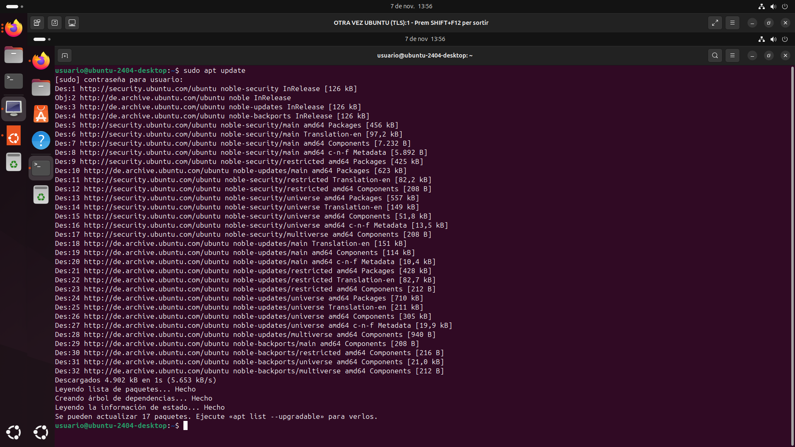

# Own-Cloud
En este tutorial, enseñaré paso a paso, como configurar Owncloud a través del terminal de Linux
# Instal·lació d'apache2, mysql i algunes llibreries al contenidor
Para este paso tendremos que hacer varios pasos pero el primero es actualizar la máquina.

Para actualizar la máquina tendremos que poner el código **sudo apt update**, después de eso le daremos a enter

.

Cuando nos pregunte la contraseña pondremos usuario, todo en minusculas y le daremos a enter

.
