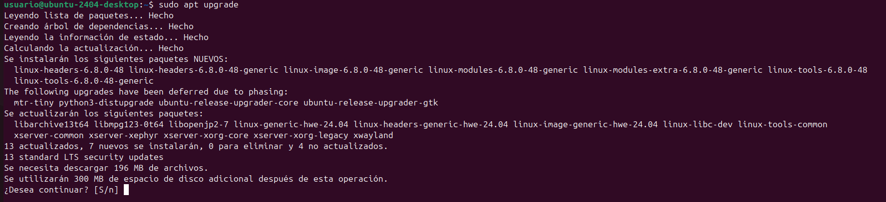
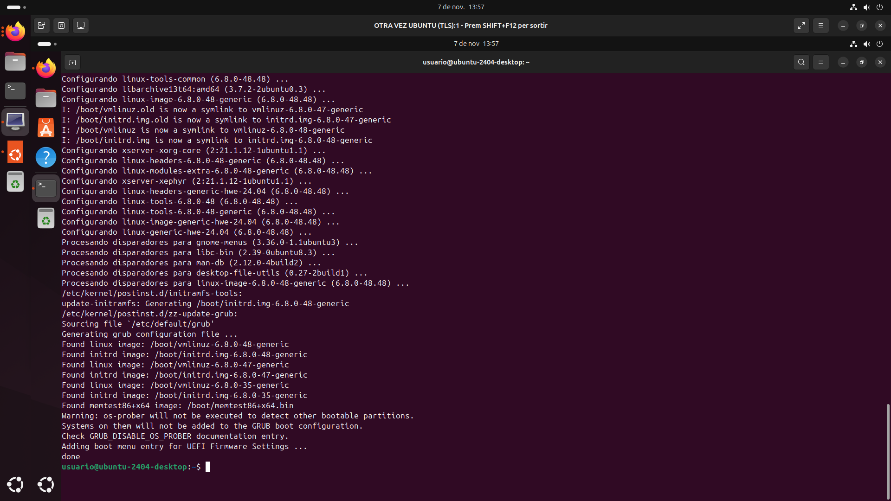
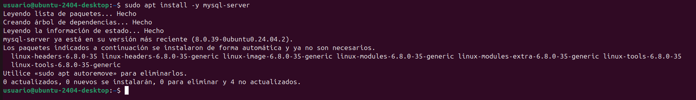

# Own-Cloud
En este tutorial, enseñaré paso a paso, como configurar Owncloud a través del terminal de Linux
# Instal·lació d'apache2, mysql i algunes llibreries al contenidor
Para este paso tendremos que hacer varios pasos pero el primero es actualizar la máquina.

Para actualizar la máquina tendremos que poner el código **sudo apt update**, después de eso le daremos a enter

Cuando nos pregunte la contraseña pondremos usuario, todo en minusculas y le daremos a enter

Después de esto le pondremos otro comando, el cual és: **sudo apt upgrade** y le daremos a enter.

Cuando nos pregunte si deseamos continuar le daremos a enter para aceptar.

Después tendremos que hacer el siguiente paso que es instalar el servidor web apache 2, para esto en el terminal tendremos que poner:**sudo apt install -y apache2**

El siguiente paso será instalar el servidor mysql-server, tendremos que poner: **sudo apt install -y mysql-server**

Después de esto tendremos que instalar algunas librerias de php, con el siguiente comando:**sudo apt install -y php libapache2-mod-php**

Seguido de esto,pondremos el comando:**sudo apt install -y php-fpm php-common php-mbstring php-xmlrpc php-soap php-gd php-xml php-intl php-mysql php-cli php-ldap php-zip php-curl**

Finamlmente reiniciamos el servidor con el siguiente comando:sudo systemctl restart apache2

