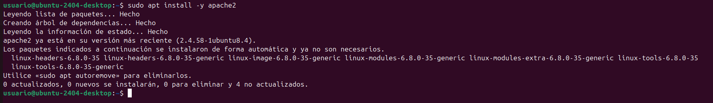
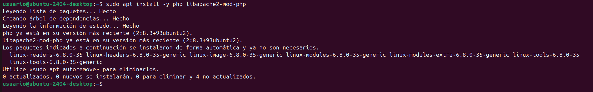
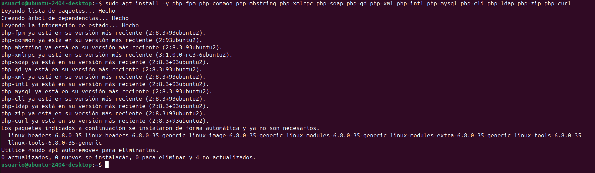

# Own-Cloud
En este tutorial, enseñaré paso a paso, como configurar Owncloud a través del terminal de Linux
# Instal·lació d'apache2, mysql i algunes llibreries al contenidor
1. Actualización de la máquina.
   
Para actualizar la máquina tendremos que poner el código **sudo apt update**, después de eso le daremos a enter

Cuando nos pregunte la contraseña pondremos usuario, todo en minusculas y le daremos a enter

Después de esto le pondremos otro comando, el cual és: **sudo apt upgrade** y le daremos a enter.

Cuando nos pregunte si deseamos continuar le daremos a enter para aceptar.

2. Instalación del servidor web `apache2`.

Para esto en el terminal tendremos que poner:**sudo apt install -y apache2**

3. Instalación del servidor de bases de datos `mysql-server`.

Tendremos que poner: **sudo apt install -y mysql-server**

4. Instalación de algunas librerías de `php`, el lenguaje principal que utilizan las aplicaciones.

Esto lo haremos con el siguiente comando:**sudo apt install -y php libapache2-mod-php**

Seguido de esto,pondremos el comando:**sudo apt install -y php-fpm php-common php-mbstring php-xmlrpc php-soap php-gd php-xml php-intl php-mysql php-cli php-ldap php-zip php-curl**

5. Reiniciamos el servidor apache2

Finamlmente reiniciamos el servidor con el siguiente comando:**sudo systemctl restart apache2**

# Configuració de MySQL

